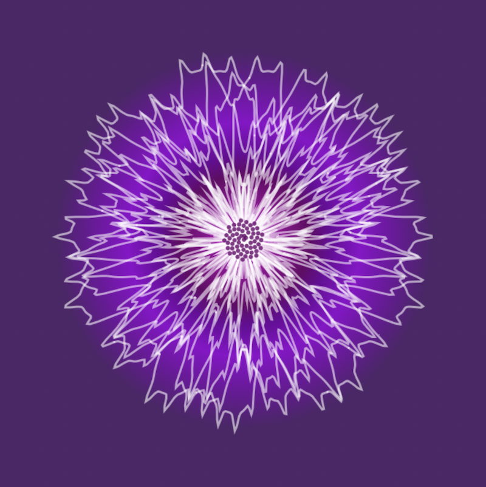

# Polar Curves

 This repository contains a collection of polar curves. 
 
 
 The base code is from Dan Shiffman's [Heart Curve Coding Challenge](https://thecodingtrain.com/challenges/134-heart-curve).   
 
 
 ## Chrysanthemum Curve

 I am using the equation for a chrysanthemum curve from [Paul Bourke](http://paulbourke.net/geometry/chrysanthemum/).  

 `r = 5 (1 + sin(11 u / 5)) - 4 sin4(17 u / 3) sin8(2 cos(3 u) - 28 u)  . . . where 0 <= u <= 21 pi`  

The center uses the code from Dan Shiffman's [Phyllotaxis Coding challenge](https://thecodingtrain.com/challenges/30-phyllotaxis).
I am also using the P5.js [patgrad](https://github.com/antiboredom/p5.patgrad) libary to add a background gradient color to the flower.

## Flower garden

## Butterfly Curve

I am using the equation for the butterfly curve from [Paul Bourke](http://paulbourke.net/geometry/butterfly/). You can also learn about the curve at [Wolfram Mathworld](https://mathworld.wolfram.com/ButterflyCurve.html).

I ran across this reference, which has the equations for the Batman, the Twitter logo and even a "bunny" curve!
[Other Curves](https://blog.wolframalpha.com/2013/07/18/even-more-formulas-for-everything-from-filled-algebraic-curves-to-the-twitter-bird-the-american-flag-chocolate-easter-bunnies-and-the-superman-solid/)

# Sources

[Wolfram Mathworld](https://mathworld.wolfram.com/topics/PlaneCurves.html)